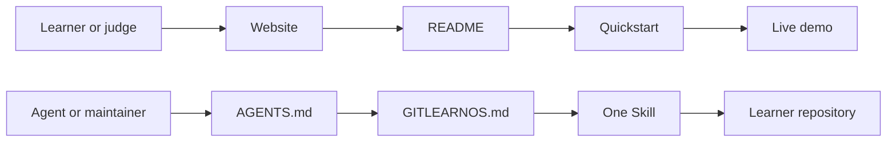

# Documentation Map

[中文](zh-CN/DOCUMENTATION.md)

English is the primary language of GitLearnOS. Human-facing entry points are
kept clear in both English and Chinese. Machine-facing contracts are maintained
in English first and do not require a Chinese duplicate.



## Start here

| Need | English | Chinese |
|---|---|---|
| Understand the product | [README](README.md) | [中文 README](zh-CN/README.md) |
| Start using it | [Quickstart](QUICKSTART.md) | [快速开始](zh-CN/QUICKSTART.md) |
| See a real Agent loop | [Live demo](LIVE-DEMO.md) | [三分钟演示](zh-CN/LIVE-DEMO.md) |
| Resolve common questions | [FAQ](FAQ.md) | [常见问题](zh-CN/FAQ.md) |
| Configure a no-Skill surface | [Project instructions](templates/project-instructions.md) | [项目自定义指令](zh-CN/templates/project-instructions.md) |
| Configure cross-chat activation | [Memory pointer](templates/native-memory-pointer.md) | [原生记忆指针](zh-CN/templates/native-memory-pointer.md) |
| Read the AceSAT case | [Impact statement](docs/acesat-build-for-impact.md) | [影响说明](zh-CN/docs/acesat-build-for-impact.md) |
| Browse the visual site | [Website](https://guojiz.github.io/gitlearnos/) | Use the `中` switch on the same page |

These eight entry points are the supported human path. A learner or judge should
not need to read the protocol, Skills, adapters, or evaluation fixtures to
understand the product.

## Machine-facing path

The executable reading order is:

```text
AGENTS.md
→ GITLEARNOS.md
→ skills/gitlearnos/SKILL.md
→ one focused reference
→ learner repository
```

`skills/gitlearnos/` is one installable bundle: only its Router is discoverable,
while operations and subject methods load from `references/` on demand.
`GITLEARNOS.md` is the canonical behavior contract. `AGENTS.md`, `skills/`,
`evals/`, adapters, and machine templates are maintained in English. Existing
Chinese translations may help a human inspect the system, but they are not
required for every machine-facing file and never override the English source.

## Deeper documentation

Files under `docs/` explain architecture, automation, privacy, deployment,
memory, and learning methods. English versions are primary. A Chinese
counterpart may be provided when the document is part of a common human
workflow; advanced implementation notes may remain English-only.

## Locale layout and alignment

All Chinese-localized content lives under the single root `zh-CN/` tree. A
translation mirrors the English relative path whenever possible:

```text
docs/architecture.md
↔ zh-CN/docs/architecture.md
```

Every Markdown file in the installable `skills/gitlearnos/` bundle has a
required same-path Chinese reading version under `zh-CN/skills/gitlearnos/`.
Stable names, paths, status values, and output fields remain in English;
explanatory prose is translated. The root English `GITLEARNOS.md` remains the
sole canonical protocol.

The Chinese Zhongkao example is localized content rather than a line-by-line
translation, so it intentionally has no exact English mirror. See the
[Chinese alignment rules](zh-CN/ALIGNMENT.md).

## Writing standard

Human-facing documentation must:

1. lead with the outcome and a concrete example;
2. use ordinary language before internal terms;
3. distinguish required, optional, and unavailable capabilities;
4. link to the next action instead of duplicating the whole protocol;
5. keep English and Chinese meaning aligned without literal, unnatural
   translation.

When a human-facing pair changes, update both files in the same change. Machine
files change in English first; translate them only when the translation has a
real reader and can be kept accurate.
