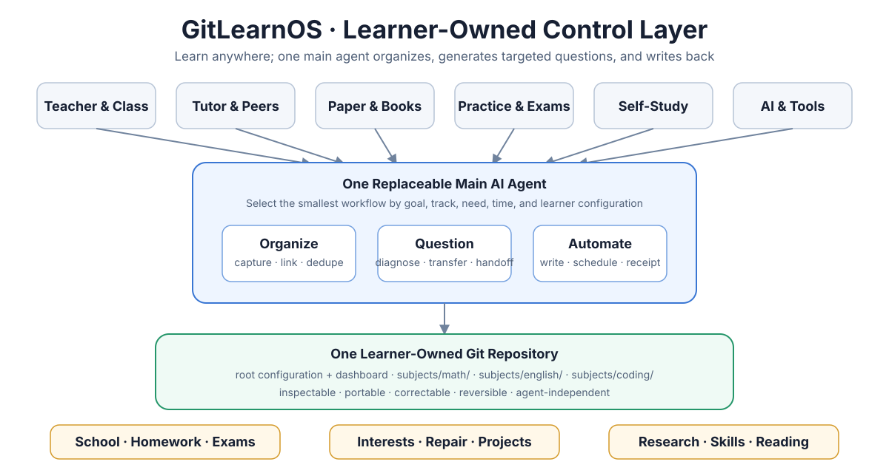
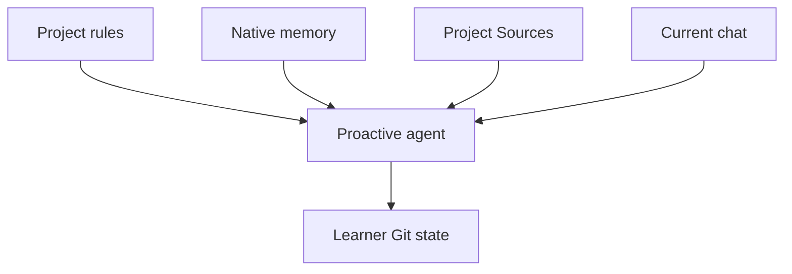

# GitLearnOS

**[Quickstart: give one request to your AI →](QUICKSTART.md)**

[中文](zh-CN/README.md) ·
[Website](https://guojiz.github.io/gitlearnos/) ·
[Documentation map](DOCUMENTATION.md) ·
[Protocol](GITLEARNOS.md)



**GitLearnOS gives an AI a learner-owned Git memory: notice real learning,
organize useful evidence, guide the next step, and write results back
automatically.**

Learning may happen with teachers, class, paper, books, practice platforms,
projects, peers, or AI. GitLearnOS does not move all learning into one app. One
replaceable main agent connects the useful evidence and next actions inside the
learner's own Git repository.

Git stays in the background. The learner does not need to manage folders,
commits, branches, or a Git hosting service during normal learning.

## It should notice learning without a command

Once configured, GitLearnOS should not wait for “use GitLearnOS,” “save this,”
or an explicit Skill invocation. A subject question, attempted answer,
photographed page, class note, teacher comment, practice result, or repeated
difficulty can be a learning event.

The agent answers the immediate need first. Under `safe-auto`, it then makes the
smallest useful writeback when value, target, and privacy are clear. If the
event is ambiguous it makes one brief suggestion or asks one necessary
question. Incidental conversation is not stored.

Cross-conversation continuity comes from:



Skills improve a workflow but are never the only activation mechanism.
The setup installs the compact
[project/custom instructions](templates/project-instructions.md) and, when
permitted, a verifiable
[native-memory pointer](templates/native-memory-pointer.md), so the core loop
survives on a surface that does not expose Skills.

## The learning loop

```text
goal and real learning input
→ automatic organization with traceable evidence
→ targeted question from the current gap
→ learner answer or external feedback
→ later independent check
→ updated state and one reversible Git commit
```

The primary success condition is observable improvement through answering and
rechecking—not merely a tidy collection of notes.

## Core capabilities

| Capability | Result |
|---|---|
| Automatic organization | notes, mistakes, teacher feedback, and platform results become linked evidence and one next action |
| Targeted questions | questions use the goal, source, current gap, and recent performance instead of random worksheet volume |
| Automated writeback | safe changes, due checks, answers, and feedback are committed and reported without making the learner maintain files |
| Proactive guidance | the agent notices useful learning events, suggests or performs one next step, and does not wait for repository commands |

Live AI tutoring is optional. A learner may work mainly with a human teacher
and use GitLearnOS for continuity, questions, and review.

## Build for impact

The [AceSAT working demo](LIVE-DEMO.md) follows a fictional public-school
student with limited data, a shared phone, short study periods, and no paid
tutoring continuity. The agent uses an existing practice summary, chooses one
high-value SAT question, preserves the answer, updates the next check, and
prepares evidence that a teacher can inspect.

The demo is deliberately text-first and local-Git compatible. It does not
require a custom app, always-on server, database, large download, or background
scheduler. It still requires access to a capable AI runtime; GitLearnOS reduces
overhead but does not pretend that devices, connectivity, or AI access are
universally available.

- [Run the three-minute demo](LIVE-DEMO.md)
- [Read the one-page impact statement](docs/acesat-build-for-impact.md)
- [Inspect the completed SAT fixture](examples/en/demo-sat-lite/)

## What you need

One main AI agent that can read and write a Git repository.

OpenAI documents Git operations for local projects, and ChatGPT may hide the
technical Git details from the everyday interface. Actual capability still
depends on the current Chat, Work, Codex, or connector session, so the agent
must verify it.

- **Chat** is the preferred daily surface for short questions, answers, note
  photos, and feedback when repository access is present. It must work without
  Skills by using project instructions, `AGENTS.md`, native memory, and event
  recognition.
- **Work** is the guided path for setup, large imports, multi-file organization,
  maintenance, and substantial review.
- **Codex or another repository agent** is useful for technical setup,
  migrations, validation, and visible Git review.

Some accounts treat Chat and Work usage differently. Use the current plan and
workspace UI as the source of truth rather than promising that Chat is always
free or that a task never consumes credits.

The target may be:

- a local Git repository;
- a standard remote Git repository;
- GitHub, GitLab, Gitea, or another Git host.

GitHub is a convenient path, not a core dependency. A database, vector store,
server, custom app, multi-agent runtime, and OpenSpace are also optional.

This project is published on GitHub because the challenge requires a GitHub
submission. That submission requirement is separate from how a learner uses
GitLearnOS. Add a remote only for chosen backup, cross-device sync,
collaboration, or publishing.

GitHub becomes especially useful for private off-device backup, cross-device
continuity, teacher or tutor review, shared course materials, and group project
work. Keep shared teaching content separate from each learner's private answers,
gaps, and history. See
[Why Git, and when GitHub helps](docs/why-github.md).

Large textbooks, PDFs, scans, media, and long-lived reference files should
usually live in ChatGPT Project **Sources**, another agent's project file area,
or an authorized local folder. Git stores compact state, provenance pointers,
selected excerpts, and history.

## Recommended: a local RAG knowledge layer

For textbooks, long course packs, notes, and durable personal knowledge, we
recommend enabling a local RAG knowledge layer. The learner may decline and
GitLearnOS still works. [RAG-Anything](https://github.com/HKUDS/RAG-Anything)
is the first explicitly supported and recommended implementation, not the only
compatible choice:

```text
                    one Main Agent
                 /        |        \
               Git   RAG-Anything   other tools
```

- **Git** is the formal memory: goals, learning history, errors, methods,
  durable knowledge, and a compact source register.
- **RAG-Anything** is the searchable layer: authorized textbooks, foundational
  materials, notes, and knowledge promoted for long-term reuse.
- **The main agent** makes every decision. Do not add a separate RAG agent and
  do not query RAG for ordinary general questions.

Temporary exercises do not enter RAG automatically. If the main agent already
understood a photo or screenshot, it inserts the faithful Markdown or
structured result instead of repeating OCR. Raw files go directly to
RAG-Anything mainly for complete books, long PDFs, large durable collections,
or documents whose images, tables, and equations must stay connected.

The current upstream package is a Python framework, so an agent must not assume
that an MCP service or one-click server already exists. It must ask about the
learning goal and material first, then choose the smallest supported parser and
model setup from the official RAG-Anything documentation. Deployment is not
complete until one authorized source is really ingested and a traceable test
query really retrieves it. See the
[RAG-Anything deployment card](docs/rag-anything.md).

## Start with one subject

First tell the agent your target repository. By default the agent treats you as
the learner, asks for the learning goal, subject, and current material, and
recommends enabling a local RAG knowledge layer. It must wait for your answer
before it installs, initializes, ingests, commits, or deploys anything.
Maintaining, documenting, testing, or publishing the public GitLearnOS template
is not learner deployment and is not blocked by this gate.

Send this to a write-capable agent:

```text
Use https://github.com/Guojiz/GitLearnOS as the GitLearnOS template.
My learning Git repository or local checkout is: <target>
Before changing anything, read GITLEARNOS.md and START-HERE.md completely. Ask
me for my learning goal, subject, and current material. Recommend that I enable
a local RAG knowledge layer, with RAG-Anything as the first supported option.
Wait for my answer before any learner installation, initialization, ingestion,
commit, or deployment. Then use
the complete skills/gitlearnos/ folder when Skills are supported. Detect whether
the main agent is Codex, Claude Code, OpenCode, ChatGPT, or another runtime;
install the folder in that agent's documented native location and verify it
appears in the Skill list. Do not depend on explicit Skill invocation. Guide me
through setup, put large source files in the project/source workspace, and
configure durable instructions plus native memory when available. Future
questions, answers, photographed pages, notes, feedback, and results should be
considered automatically. Detect actual repository, Git, memory, source, and
scheduling capability. Use safe-auto: answer first, organize useful evidence,
guide the next step, and commit safe reversible writeback. Preserve original
answers, notes, and external feedback. Do not store the full conversation or
claim mastery without delayed independent evidence. Finish with activation
surfaces, verified Skill status, changed files, actual automation, the next
action, and the undo boundary.
```

The agent should initialize only the current subject and the files needed now.
See the complete [Quickstart](QUICKSTART.md).

## One repository, subject folders

```text
gitlearnos.yml
AGENTS.md
learning-policy.md
dashboard.md
learner-profile.md
subjects/
└── math/
    ├── goals/
    ├── sources/
    ├── models/
    ├── knowledge-gaps/
    ├── handoffs/
    ├── reviews/
    └── events/
```

Git does not preserve empty folders. The agent creates each optional folder on
first real use.

## Truth before completeness

- Original answers, notes, and external feedback are preserved.
- Corrections become new linked records instead of silent rewrites.
- AI summaries, models, gaps, and plans may be revised.
- Important conclusions link evidence; missing evidence remains unknown.
- Ordinary chat and hidden reasoning are not stored.
- External resolution and independent mastery remain separate.

The dashboard is a current view, not a second source of truth.

## Automation that acts

The portable base defines two operations:

- `due-review`: read due evidence and deliver concrete answerable questions;
- `maintenance`: reconcile input, waiting feedback, stale views, and
  contradictions.

An interactive agent performs immediate work and checks due items when it
resumes. Background work requires a real external scheduler with repository
access. A reminder alone is not completed repository work.

See [Automation adapters](adapters/automation/README.md).

## Skills and subject methods

Install the complete [GitLearnOS Skill folder](skills/gitlearnos/), not only its
`SKILL.md`. One discoverable Router loads setup, organization, question,
review, source, model, optional tutoring, maintenance, and subject references
only when needed.

Codex and OpenCode default to `.agents/skills/gitlearnos/`; Claude Code uses
`.claude/skills/gitlearnos/`. A source file in this template is not an
installation—the active runtime must list `gitlearnos`. See the
[cross-agent installation map](adapters/agents/README.md#skill-discovery-by-agent).

OpenSpace may later evaluate this generic Skill through an
[optional integration](integrations/openspace/README.md); it is not required.

## Evaluation

GitLearnOS uses documented end-to-end scenarios rather than exact AI text
matching. The v2 acceptance cases cover bootstrap, implicit learning-event
recognition, note organization, teacher feedback, due questions, answer
writeback, non-fabrication, idempotency, cross-agent Skill discovery, and a
complete local-Git workflow.

See [Evaluation](evals/README.md).

Existing repositories can move gradually with
[the v2 migration guide](MIGRATION-v2.md); old evidence does not need a
one-time bulk relocation.

## Examples

- [Teacher feedback to delayed mathematics review](zh-CN/examples/demo-zhongkao-lite/)
- [SAT Reading and Writing](examples/en/demo-sat-lite/)
- [Research reading](examples/en/demo-research-reading-lite/)

## Project status

This branch develops the Git-native v2 protocol.

MIT License. See [LICENSE](LICENSE).
