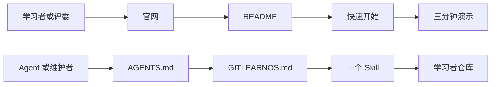

# 文档地图

[English](../DOCUMENTATION.md)

GitLearnOS 以英文为第一语言。给学习者、评委和普通读者看的核心入口同时提供清楚、自然的中英文；给 Agent 执行的契约以英文维护。所有 Skills 同时提供中文阅读版，但稳定机器标识仍使用英文。



## 从这里开始

| 需求 | 英文 | 中文 |
|---|---|---|
| 了解产品 | [README](../README.md) | [中文 README](README.md) |
| 开始使用 | [Quickstart](../QUICKSTART.md) | [快速开始](QUICKSTART.md) |
| 看一次真实 Agent 闭环 | [Live demo](../LIVE-DEMO.md) | [三分钟演示](LIVE-DEMO.md) |
| 解决常见疑问 | [FAQ](../FAQ.md) | [常见问题](FAQ.md) |
| 配置无 Skill 界面 | [Project instructions](../templates/project-instructions.md) | [项目自定义指令](templates/project-instructions.md) |
| 配置跨对话激活 | [Memory pointer](../templates/native-memory-pointer.md) | [原生记忆指针](templates/native-memory-pointer.md) |
| 记录已验证重复任务 | [Automation state](../templates/automation.md) | [自动化状态](templates/automation.md) |
| 添加可选本地知识检索 | [RAG-Anything card](../docs/rag-anything.md) | [RAG-Anything 部署卡](docs/rag-anything.md) |
| 使用 DeepSeek Harness Developer Preview | [Harness adapter](../adapters/deepseek-harness/README.md) | [Harness 适配器](adapters/deepseek-harness/README.md) |
| 阅读 AceSAT 案例 | [Impact statement](../docs/acesat-build-for-impact.md) | [影响说明](docs/acesat-build-for-impact.md) |
| 浏览可视化官网 | [Website](https://guojiz.github.io/gitlearnos/) | 在同一页面点击 `中` |

这些入口构成正式的人类阅读路径。学习者和评委无需阅读协议、Skills、适配器或评测夹具，也应当能理解产品并开始使用。

## Agent 执行路径

机器读取顺序是：

```text
AGENTS.md
→ GITLEARNOS.md
→ skills/gitlearnos/SKILL.md
→ 一个聚焦的参考文件
→ 学习者仓库
```

`skills/gitlearnos/` 是一个可安装包：只有 Router 可被发现，操作和学科方法从
`references/` 按需加载。`GITLEARNOS.md` 是唯一正式行为契约。`AGENTS.md`、
`skills/`、`evals/`、适配器和机器模板以英文维护。已有中文翻译可以帮助人类
检查系统，但机器文件不要求全部提供中文，且中文永远不能覆盖英文原文。

DeepSeek Harness 用户应把仓库根目录作为固定提交的 Developer Preview bundle
安装，再验证 profile 配置。当前 Host 基座含两个只读工具与一条狭窄 Git 事件
事务；准确的安装、卸载、验证、安全、模型、调度与路线图边界见
[Harness 适配器说明](adapters/deepseek-harness/README.md)。

## 深入文档

`docs/` 下的文件解释架构、自动化、隐私、部署、记忆与学习方法。英文是主要版本；常见人类流程可以提供中文，高级实现说明可以只保留英文。

## 统一目录与对齐

所有中文内容都放在根目录 `zh-CN/` 中。翻译文件尽量镜像英文相对路径：

```text
docs/architecture.md
↔ zh-CN/docs/architecture.md
```

可安装 `skills/gitlearnos/` 包内每份 Markdown 文件都必须在
`zh-CN/skills/gitlearnos/` 下有同路径中文阅读版。Skill 名称、路径、状态值和
输出字段保持英文，说明文字翻译为中文。根目录英文 `GITLEARNOS.md` 始终是
唯一正式协议。

中文中考示例属于独立本地化场景，不是某个英文示例的逐字翻译，因此不要求同路径英文副本。完整要求见[中英文对齐规则](ALIGNMENT.md)。

## 写作标准

给人看的文档必须：

1. 先讲结果，再给具体例子；
2. 先用普通语言，再引入内部术语；
3. 分清必需、可选与当前不可用的能力；
4. 链接到下一步，不重复整套协议；
5. 中英文含义一致，但不做生硬逐字翻译。

人类入口发生变化时，中英文应在同一次改动中更新。机器文件先改英文；只有确实存在读者，并且能够持续保持准确时才翻译。
