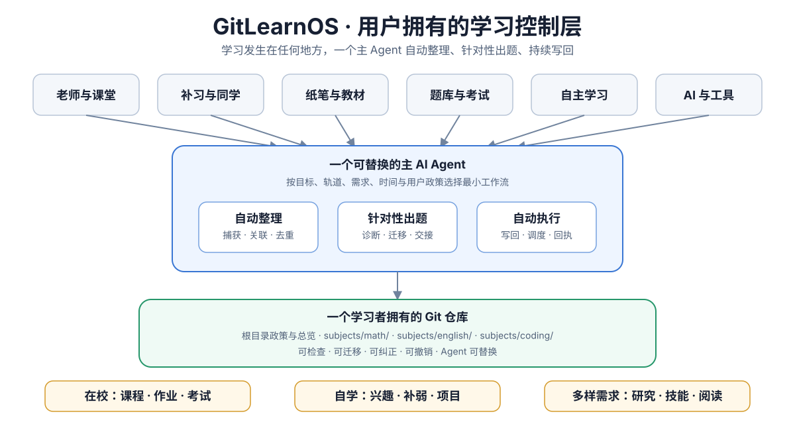
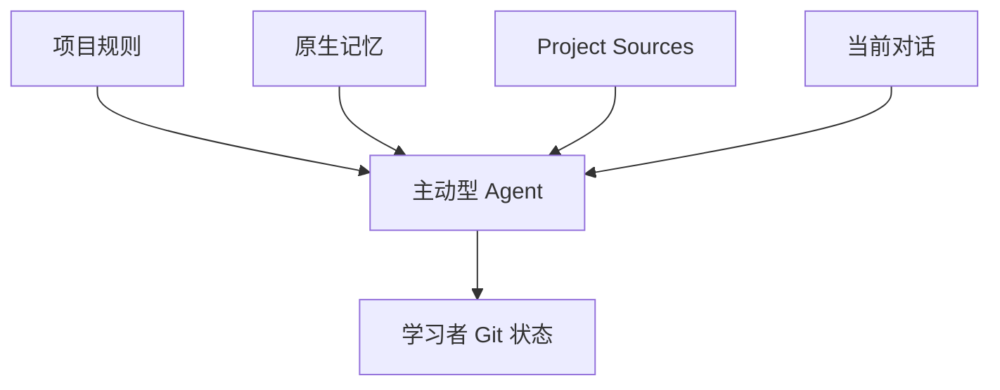

# GitLearnOS

<p align="center">
  
</p>

<p align="center"><strong>DeepSeek Harness 原生支持 · GitLearnOS 独家学习面板</strong></p>

**[快速开始：把一段话交给你的 AI →](QUICKSTART.md)**

[English](../README.md) ·
[官网](https://guojiz.github.io/gitlearnos/) ·
[文档地图](DOCUMENTATION.md) ·
[英文正式协议](../GITLEARNOS.md) ·
[中文协议](GITLEARNOS.md)



**GitLearnOS 为 AI 提供一套由学习者拥有的 Git 记忆：注意真实学习，整理有用证据，引导下一步，并把结果自动写回。**

学习可以发生在老师、课堂、纸笔、教材、题库、项目、同伴或 AI 中。GitLearnOS 不把所有学习搬进一个应用；一个可替换的主 Agent 把真正有价值的证据与下一步连接在学习者自己的 Git 仓库里。

Git 在后台工作。正常学习时，用户不需要管理文件夹、提交、分支或 Git 托管平台。

## 不必喊它，它也应注意到学习

设置完成后，GitLearnOS 不应等待“使用 GitLearnOS”“保存这个”或显式 Skill 调用。学科问题、作答尝试、拍摄页面、课堂笔记、教师评语、练习结果或反复困难，都可能是学习事件。

Agent 先处理眼前需要。在 `safe-auto` 下，价值、目标和隐私明确时，再做最小且有用的写回。事件含糊时，只给一个简短建议或问一个必要问题。偶然聊天不会被保存。

跨对话连续性来自：



Skills 能改善具体工作流，但永远不是唯一触发方式。
设置时会安装精简的[项目或自定义指令](../templates/project-instructions.md)，
并在获允许时配置可验证的[原生记忆指针](../templates/native-memory-pointer.md)，
因此不提供 Skills 的界面仍能维持核心闭环。

## 学习闭环

```text
目标与真实学习输入
→ 带证据的自动整理
→ 根据当前薄弱点针对性出题
→ 用户作答或获得外部反馈
→ 之后独立复测
→ 更新状态并形成一次可撤销 Git 提交
```

首要成功标准是通过作答和复测得到可观察的提升，而不是只把笔记整理整齐。

## 核心能力

| 能力 | 结果 |
|---|---|
| 自动整理 | 笔记、错题、老师反馈和平台结果成为互相连接的证据与一个下一步 |
| 针对性出题 | 根据目标、来源、当前薄弱点和最近表现出题，不随机堆题 |
| 自动写回 | 自动提交并报告安全修改、到期检查、作答和反馈，用户不用维护文件 |
| 主动引导 | Agent 注意到有价值的学习事件，建议或完成一个下一步，不等待仓库命令 |

实时 AI 辅导只是可选能力。学习者可以主要跟真人老师学习，只使用 GitLearnOS 保持连续性、准备问题和复测。

## 为实际影响而构建

[AceSAT 可运行演示](LIVE-DEMO.md)使用一个虚构的公立学校学生场景：流量有限、共用手机、学习时间短，也没有持续付费辅导。Agent 复用已有练习摘要，选择一道最有价值的 SAT 问题，保留作答，更新下一次检查，并准备老师可以核对的证据。

演示刻意采用纯文本和本地 Git，不要求独立应用、常驻服务器、数据库、大型下载或后台调度器。它仍然需要一个可用的 AI 运行环境；GitLearnOS 能降低额外负担，但不会假装设备、网络或 AI 服务已经人人可得。

- [运行三分钟演示](LIVE-DEMO.md)
- [阅读一页影响说明](docs/acesat-build-for-impact.md)
- [查看完整 SAT 示例](../examples/en/demo-sat-lite/)

## 使用条件

一个能够读写 Git 仓库的主 AI Agent。

OpenAI 文档说明本地 Project 可以进行 Git 操作，而 ChatGPT 的日常界面可能隐藏技术细节。实际能力仍取决于当前 Chat、Work、Codex 或连接器会话，因此 Agent 必须验证。

- **Chat**：当前会话具备仓库访问时，优先用于短问题、作答、笔记照片和反馈。即使不提供 Skills，也要通过项目指令、`AGENTS.md`、原生记忆和事件识别工作。
- **Work**：用于引导式设置、大型导入、多文件整理、维护和较大复习。
- **Codex 或其他仓库 Agent**：用于技术设置、迁移、验证和可见的 Git 审查。

不同账号可能用不同方式计算 Chat 与 Work 用量。以当前套餐和工作区界面为准，不承诺 Chat 永远免费，也不承诺某项任务绝不消耗额度。

目标仓库可以是：

- 本地 Git 仓库；
- 标准远程 Git 仓库；
- GitHub、GitLab、Gitea 或其他 Git 托管平台。

GitHub 是方便的使用路径，不是核心依赖。数据库、向量库、服务器、独立应用、多 Agent 运行环境和 OpenSpace 也都是可选项。

本项目放在 GitHub，是因为比赛要求提交 GitHub 仓库；这与学生如何使用 GitLearnOS 是两回事。只有用户主动需要备份、跨设备同步、协作或公开发布时，才需要添加远程仓库。

GitHub 特别适合私有异地备份、跨设备连续性、教师或导师审阅、共享课程资料和小组项目。共享教学内容应与每位学习者的私密答案、缺口和历史分开。见[为什么用 Git，以及何时接入 GitHub](docs/why-github.md)。

大型教材、PDF、扫描件、媒体和长期参考文件通常放在 ChatGPT Project **Sources**、其他 Agent 的项目文件区或获授权的本地文件夹中。Git 保存紧凑状态、出处指针、选定片段和历史。

## 建议启用：本地 RAG 知识层

学习者拥有教材、长期课程包、笔记或需要长期检索的个人知识时，默认建议启用
本地 RAG 知识层。学习者可以拒绝，GitLearnOS 仍然工作。
[RAG-Anything](https://github.com/HKUDS/RAG-Anything) 是首个明确支持和推荐的
实现，不是唯一兼容选择：

```text
                    唯一主 Agent
                 /        |        \
               Git   RAG-Anything   其他工具
```

- **Git** 是正式记忆：目标、学习历史、错误、方法、长期知识和精简资料登记。
- **RAG-Anything** 是检索层：获授权教材、基础资料、笔记和晋升后的长期知识。
- **主 Agent** 负责所有决定。不要增加 RAG Agent，普通通用问题也不查询 RAG。

临时练习不会自动进入 RAG。主 Agent 已经理解照片或截图时，插入忠实 Markdown
或结构化结果，不重复 OCR。只有完整教材、长 PDF、大型长期资料，或需要保持
图片、表格和公式关系的文档，才主要把原文件直接交给 RAG-Anything。

当前上游是 Python 框架，因此 Agent 不能假设 MCP 服务或一键服务器已经存在。
它必须先询问学习目标和资料，再根据官方 RAG-Anything 文档选择最小解析器与
模型配置。只有一份获授权真实资料完成导入，并且一次可追溯测试查询确实检索到
它，才能认为部署完成。详见 [RAG-Anything 部署卡](docs/rag-anything.md)。

## 从一科开始

先告诉 Agent 目标仓库。Agent 默认把你当作学习者，必须再询问学习目标、学科和
当前资料，并建议启用本地 RAG 知识层；在收到回答前，不得安装、初始化、导入、
提交或部署。

维护、编写文档、测试或发布公开 GitLearnOS 模板不属于学习者部署，不受此门槛
阻止。

把下面这段交给有写入能力的 Agent：

```text
请把 https://github.com/Guojiz/GitLearnOS 作为 GitLearnOS 模板。
我的学习 Git 仓库或本地工作区是：<目标>
修改任何内容前，完整阅读 zh-CN/GITLEARNOS.md 和 zh-CN/START-HERE.md。
询问我的学习目标、学科和当前资料，建议启用本地 RAG 知识层，并把
RAG-Anything 作为首个支持选项。安装、初始化、导入、提交或部署学习者状态前
必须等我回答。然后在环境
支持 Skills 时使用
完整 skills/gitlearnos/ 文件夹。检查主 Agent 是 Codex、Claude Code、
OpenCode、ChatGPT 还是其他运行环境；把该文件夹安装到正式记录的原生位置，
并验证 Skill 清单确实出现它。不要依赖显式 Skill 调用。引导我完成设置，把大型
来源文件放在项目或来源工作区中，并在可用时配置持久指令和原生记忆。以后即使
我不提 GitLearnOS，也要自动考虑我的问题、作答、拍摄页面、笔记、反馈和结果。
检查真实的仓库、Git、记忆、来源与调度能力。使用 safe-auto：先解决我眼前的
需要，再整理有价值的证据，引导下一步，并提交安全、可撤销的写回。保留原始
作答、笔记和外部反馈；不要保存完整聊天，也不能在没有间隔后独立作答证据时
声称已经掌握。设置时，为 `maintenance` 和 `due-review` 分别确定学习者本地重复执行时间
与 IANA 时区，在真正拥有仓库能力的调度器中创建并测试两项任务；我接受默认值
时分别使用 21:30 和 07:00。任一任务未验证时，必须把部署自动化标记为未完成，
不能拿提醒代替。最后报告触发层、已验证 Skill 状态、改动文件、实际完成的自动化、
下一步和撤销边界。
```

Agent 只初始化当前学科与当前真正需要的文件。完整说明见[快速开始](QUICKSTART.md)。

## 一个仓库，分科学科文件夹

```text
gitlearnos.yml
AGENTS.md
learning-policy.md
automation.md
dashboard.md
learner-profile.md
subjects/
└── math/
    ├── goals/
    ├── sources/
    ├── models/
    ├── knowledge-gaps/
    ├── handoffs/
    ├── reviews/
    └── events/
```

Git 不保存空目录。每个可选目录只在第一次真实使用时由 Agent 创建。

## 实事求是优先于看起来完整

- 保留原始作答、笔记和外部反馈。
- 纠正通过新增并链接记录完成，不静默覆盖。
- AI 总结、模型、薄弱点和计划可以根据新证据修改。
- 重要判断必须链接证据；缺少证据就保持未知。
- 不保存普通聊天和隐藏推理。
- 外部已经解决与学习者独立掌握始终分开。

Dashboard 只是当前视图，不是第二套事实。

## 必须设置、真正推动学习的重复自动化

每次学习者部署都必须为以下两个重复任务确定学习者本地时间与 IANA 时区：

- `maintenance`：处理待整理输入、等待反馈、过时视图与矛盾状态；默认每天
  **21:30**；
- `due-review`：读取到期证据并交付能够立即作答的具体题目；默认每天
  **07:00**。

学习者可以修改两个时间。只有真正拥有仓库能力的调度器列出这两项重复任务，且
两项都完成一次可观察试运行，部署自动化才算完成。政策写入
`learning-policy.md`，真实运行状态写入 `automation.md`。提醒、日期、提示词或
接手时检查都不算。没有真实调度器时，交互式学习仍可使用，但必须报告部署
自动化 `incomplete`。

每天重复表示每天检查，不表示每天强行制造内容。没有新证据需要整理或没有到期
复测时，任务应静默 `skipped`：不制造凑数题、不通知学习者、不做只改时间戳的
提交，也不创建空提交。

见[自动化适配器](adapters/automation/README.md)。

## Skills 与学科方法

安装完整的 [GitLearnOS Skill 文件夹](../skills/gitlearnos/)，不能只安装其中的
`SKILL.md`。一个可发现 Router 只在需要时加载设置、整理、出题、复测、来源、
模型、可选辅导、维护与学科参考文件。

Codex 与 OpenCode 默认使用 `.agents/skills/gitlearnos/`；Claude Code 使用
`.claude/skills/gitlearnos/`。模板里存在源文件不等于已经安装；当前运行环境
必须真正列出 `gitlearnos`。见
[跨 Agent 安装表](adapters/agents/README.md#不同-agent-如何发现-skill)。

OpenSpace 将来可以通过[可选接入](integrations/openspace/README.md)评测这个
通用 Skill；运行 GitLearnOS 不需要它。

## GitLearnOS 独家 DeepSeek Harness 支持

GitLearnOS 现已提供 DeepSeek Harness 原生学习入口。会话输入框旁有一条
`GitLearnOS ▸`；主 Agent 判断现在查看队列有帮助时可以让它展开，不宜打断时则保持
收起，学习者始终可以手动切换。面板显示主 Agent 在学习者自己的 Git 仓库中维护的
学习队列，顺序完全保留，并可直接选择复习、做题、问老师或查看自己的笔记。讲完
一个点后，Agent 还能用 Harness 自带的一道多选做轻量收尾，而不是把会话变成不断
弹题的考试。

bundle 同时提供诚实的状态与路由，以及一条狭窄、受政策约束的 Git 事件事务。
Host 不替学习者排顺序：它只提供证据，由主 Agent 综合目标、难度、重要性、掌握度、
巩固度和当前限制判断下一步。参见[发布说明](docs/deepseek-harness-launch.md)以及
[安装、验证、限制与原生路线图](adapters/deepseek-harness/README.md)。

前往 **[GitLearnOS 官网](https://guojiz.github.io/gitlearnos/#harness)** 查看完整介绍。

这仍是 Developer Preview：尚未提供原生 RAG 调用或经过验证的冷会话后台工作。
DeepSeek 官方 provider 只处理文本，Harness 的会话内 Schedule 也不能代替真正的
仓库重复自动化。

## 评测

GitLearnOS 使用完整场景评测，不逐字比较 AI 输出。v2 验收覆盖初始化、隐式学习
事件识别、整理笔记、老师反馈、到期出题、作答写回、不编造、去重、跨 Agent
Skill 发现以及完整的本地 Git 工作流。

见[评测](evals/README.md)。

已有仓库可按 [v2 迁移说明](MIGRATION-v2.md)渐进调整，不需要一次性搬完
所有旧证据。

## 示例

- [老师反馈到延迟数学复测](examples/demo-zhongkao-lite/)
- [SAT 阅读与写作](../examples/en/demo-sat-lite/)
- [研究阅读](../examples/en/demo-research-reading-lite/)

## 项目状态

本分支正在开发 Git 原生 v2 协议。

MIT License，见 [LICENSE](../LICENSE)。
